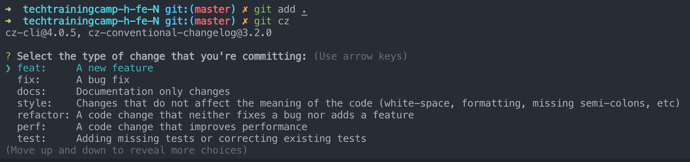

# techtrainingcamp-h-fe-3

## 项目结构

```
|   .browserslistrc   # 默认的配置
|   .gitignore        # 默认的配置
|   babel.config.js   # 默认的配置
|   package.json      # 下载了axios, vuex, vue-router
|   README.md
|   vue.config.js     # 添加了"@"的路径
|
+---public            # 存放默认的静态资源
|       favicon.ico
|       index.html
|
\---src
    |   App.vue       # 项目入口
    |   main.js       # 项目入口
    |
    +---assets        # 存放项目内用到的静态资源
    |   \---img       # 存放图片
    |
    +---components    # 存放可复用的页面组件, 主要目录之一
    |
    +---network       # 存放网络请求相关代码
    |
    +---routers       # vue-router
    |       index.js
    |
    +---store         # vuex
    |
    \---views         # 存放主要页面
```

## contribute

1. 编码规范

    使用 eslint 的 airbnb 规范，通过 vue-cli 的设置现在会在 commit 之前自动 lint 一遍，请先跑通 lint 再 commit 代码以保证代码规范

    > 建议配合使用 vscode 的 eslint 插件，设置保存自动 lint；部分不合适的 rules 可在群里讨论后进行修改

2. commit message 规范

    遵循 Angular Commit 规范，为了方便编写遵循规范的 commit message，我们使用 Commitizen 进行 git commit

    1. 先安装 commitizen

        ```shell
        $ yarn global add commitizen
        ```

    2. 安装好以后，凡是用到 git commit 命令，一律改为使用 git cz。这时，就会出现选项，用来生成符合格式的 Commit message

        

    > 更多详见 [Commit message 和 Change log 编写指南](https://www.ruanyifeng.com/blog/2016/01/commit_message_change_log.html)

3. 提交代码规范

    我们通过 GitHub 仓库中的 project 管理 todolist，在编写新 feature 时开一个新的 git 分支，之后在 fix bug 等时也在对应分支下进行修改，push 到远程仓库（GitHub）后经过小组其他人进行 Code Review 后再合并到 master

4. 其他应该注意的

    - 已配置路径 alias

        ```js
        config.resolve.alias
          .set('@', resolve('./src'))
          .set('components', resolve('./src/components'))
          .set('assets', resolve('./src/assets'))
          .set('common', resolve('./src/common'))
          .set('network', resolve('./src/network'))
          .set('views', resolve('./src/views'));
        ```

    - 使用 [postcss-px-to-viewport](https://github.com/evrone/postcss-px-to-viewport) 进行移动端 vw 适配，编写时直接按照 375px 宽度移动端的视觉稿进行编写即可（简单认为手机屏幕宽度为 375px，postcss 会自动适配其他宽度的手机）

    - 使用 GitHub Actions 进行 CI 配置，master 分支更新后会自动发布到 GitHub Page

    - UI 风格可参考 [https://www.zcool.com.cn/work/ZMjE3Mzk1NTI=.html](https://www.zcool.com.cn/work/ZMjE3Mzk1NTI=.html)；卡片可参考 [https://www.zcool.com.cn/work/ZMzQ0Nzc1MjA=.html](https://www.zcool.com.cn/work/ZMzQ0Nzc1MjA=.html)；小图标可参考 [https://www.zcool.com.cn/work/ZMzkyMzQ5MDQ=.html](https://www.zcool.com.cn/work/ZMzkyMzQ5MDQ=.html)
